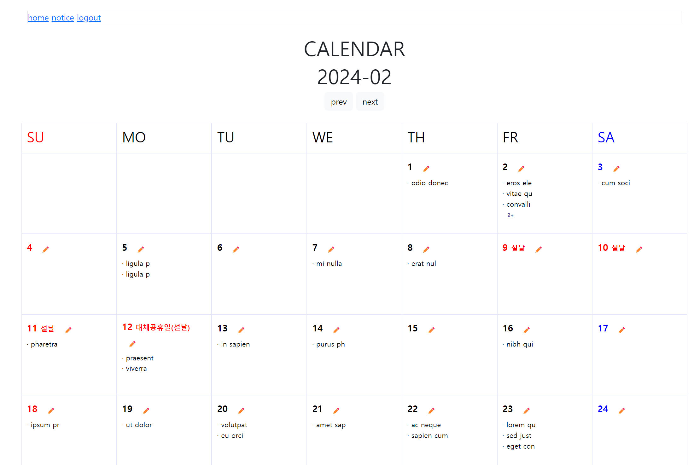

1인 캘린더 프로젝트

## v1.0.0  `231128
 아파치톰캣9, JSP, JDBC model 2 캘린더

## v2.0.0 `231205
 스프링부트3, MVC, 마이바티스 캘린더 
✔️스프링부트로 Migration  
✔️캘린더Vo를 통합화

## v2.1.0 (목표)
- ✔️java.net기반의 공공데이터포털 기존 휴일정보API를 RestTemplate으로 리팩토링하기  
[HolidayApiRestTemplateImpl.java](src%2Fmain%2Fjava%2Fcom%2Fmaskun%2Fprojectdiary%2FexternalApiRequest%2FHolidayApiRestTemplateImpl.java)  
- 🏃‍♂️인터페이스로 결합도 낮추기  
 [HolidayApi.java](src%2Fmain%2Fjava%2Fcom%2Fmaskun%2Fprojectdiary%2FexternalApiRequest%2FHolidayApi.java)
- 🏃‍사용 용어, 단어 일원화를 위한 식별자 사전 작성
- DTO 와 DomainEntity 분리시키기
- 프론트 입력폼의 유효성 검사&서버 유효성검사 추가
- 컨트롤러와 서비스 단의 모든 테스트 코드 추가하기
- ClassdocComment 모두 작성하기

## v2.2.0 (목표)
- view template 을 thymeleaf 변경하기
- controller를 대부분 RESTApiController로 변경하기
- 한번 받아온 공공데이터 휴일정보API를 인메모리DB로 저장될 수 있도록 변경하기
- 권한제어를 Spring security로 변경하기
- 홈화면을 각 기능에 접근이 쉬운 okky 스타일로 변경하기
